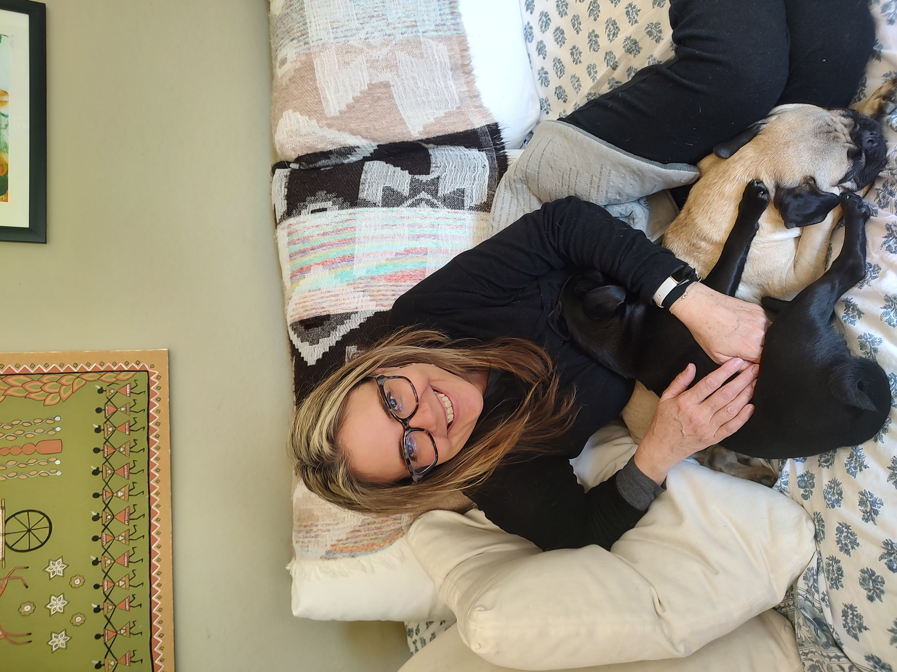

@font-face { <style = font-family: Open Dyslexic; src: url('opendyslexic.otf');> }

### *I want to talk about something else, which is the emotional life of illness. This seems like an equally difficult but more neglected task. Rather than being unique or emblematic, my story is so brutally common that sometimes I feel like telling it all over again is like explaining to sick women that the sky is blue. We know medicine is fucked up beyond all belief. How can we live anyway?*

#### (from *Sick Woman Mansion*, current work-in-progress)

-----

Dr. Megan Moodie is an interdisciplinary writer, artist, and feminist scholar who works in a variety of mediums, from lyrical essay to film and dance to academic research. In a recent interview on Brown University's podcast "Meeting Street," she described her unique and eclectic approach: "I’m doing... a form of research-creation, where you don’t decide on a method, or a genre, or a voice prior to engagement with the material you’re trying to work through. You try to train yourself in several different methodologies or artistic practices, and then pick the tool for the job" ([https://humanities.brown.edu/media/meetingst/13](https://humanities.brown.edu/media/meetingst/13)).

Moodie's first book, We Were Adivasis (University of Chicago Press, 2015), about gender injustice and indigenous communities in India, was described as revealing “new vistas for feminist studies”; her articles have been widely published and reprinted in flagship journals and collections.

In literary venues, Moodie's lyrical essay “Birthright” (Chicago Quarterly Review, Vol 26) about her diagnosis with hypermobile Ehlers-Danlos Syndrome at age 40, was named a “Notable Essay of the Year” by Best American Essays (2019). She was also long-listed for the CRAFT journal creative non-fiction prize in 2021.

Moodie has been a professor of anthropology at the University of California, Santa Cruz since 2009, where she teaches classes in feminist theory and disability justice that bring together social science research methods and the arts.

She is also the subject of an on-going documentary film project about her life in dance, “Inventory of Joy,” created with collaborator Cynthia Ling Lee ([https://vimeo.com/810305619/3b500393c6](https://vimeo.com/810305619/3b500393c6)).

Moodie lives in Santa Cruz with her partner, a linguist, her son, a film buff, and their two salt-and-pepper pugs.

-----

#### Web page created by [Toma Brasoveanu](https://meganmoodie.github.io/toma.html) using Jekyll
